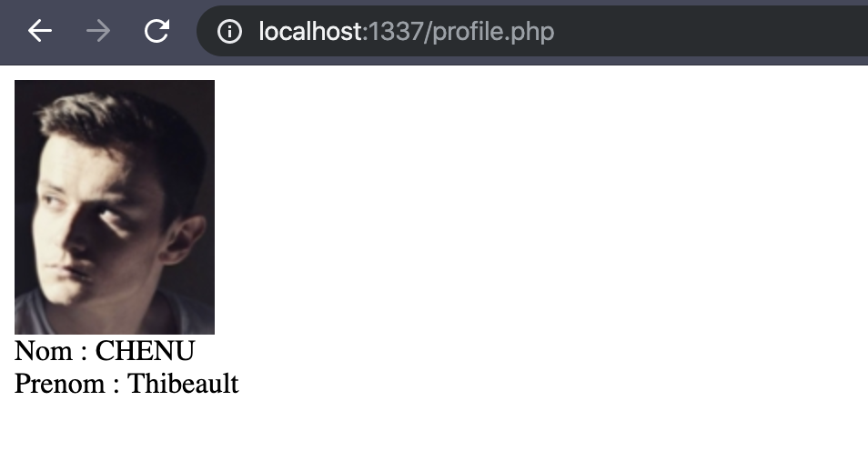

# MyGes API Client Library for PHP #

This library allows students to obtain information about their schooling (agenda, grades, absences, teachers, classes, students) if their school is part of the [GES organization](https://www.myges.fr/).

**NOTE** This library is unofficial, if you find a bug please feel free to contribute with a PR. 

## Requirements ##

* [PHP 7.2 or higher](https://www.php.net/)

## Installation ##

### Composer

Execute the following command to install this library:

```sh

composer require tchenu/myges

```

Include the autoloader

```php

require_once  'vendor/autoload.php';

```

  ## How to connect ##

You can connect your account with the `client-id` of the Skolae application.

```php

<?php

require_once  'vendor/autoload.php';

try {
    // client-id = skolae-app
    $client = new MyGes\Client('skolae-app', 'your-login', 'your-password');
} catch(Exception $e) {
    die($e->getMessage()); // bad credentials
}
```

## Examples ##

Run the following command to [start a web server with PHP](https://www.php.net/manual/en/features.commandline.webserver.php). 
  

```

$ composer run-script examples

```

  

And then browsing to `http://localhost:1337/profile.php` (or any example available in the `examples` folder).

  

### Example ###

  

```php

<?php

require_once  'vendor/autoload.php';

try {
    $client = new MyGes\Client('<client-id>', '<login>', '<password>');
} catch(Exception $e) {
    die($e->getMessage()); // bad credentials
}

$me = new MyGes\Me($client);

$profile = $me->getProfile();

echo  "_links->photo->href ."'></br>";
echo  "Nom : ". $profile->name ."</br>";
echo  "Prenom : ". $profile->firstname ."</br>";

```


